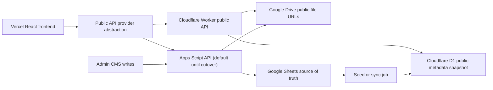

# Backend Migration Readiness Audit - 2026-05-27

Status: documentation and readiness audit only. This checkpoint does not add a Cloudflare Worker, D1 schema file, Wrangler configuration, frontend provider switch, production configuration, or backend implementation change.

## Executive Summary

The structural refactor sequence is complete enough to begin backend migration planning. P1-P5, G3-G4, Wave 1, Wave 2, Wave 3, the final refactor checkpoint, and commitlint setup gave public reads, admin CMS groups, public documents, site-view tracking, visitor stats settings, and many contracts feature-oriented entry points. `src/types.ts` is now mostly a compatibility facade plus intentionally retained aggregate and auth contracts. `src/services/googleApi.ts` intentionally remains the implementation and transport owner.

More structural splitting now has lower return on investment. The main user-visible bottleneck is network/backend latency: the existing public API crosses `script.google.com`, Apps Script execution, Sheets reads, record normalization, and payload assembly. The existing performance note records public `script.google.com` calls taking 7+ seconds across pages, not only on the homepage.

The recommended migration is public-read-first:

1. Add a Cloudflare Worker public API alongside Apps Script.
2. Store public metadata snapshots in Cloudflare D1.
3. Keep Google Drive as file storage.
4. Keep Apps Script admin writes as the temporary source of truth.
5. Preserve current response shapes.
6. Add an environment-controlled provider switch only after Worker routes are proven in preview.
7. Roll back by switching the provider to Apps Script.

This avoids a whole-project rewrite. The migration targets the highest-impact public traffic while leaving sensitive auth, admin writes, Drive uploads, and Apps Script deployment behavior intact until the read path is proven.

## Current Bottleneck Analysis

### Observed Latency

[`docs/performance/public-api-cache-diagnostics-2026-05-20.md`](../performance/public-api-cache-diagnostics-2026-05-20.md) records Chrome DevTools observations of public `script.google.com` requests taking 7+ seconds across public pages. The issue affects multiple resources, so it cannot be solved by homepage-only UI work.

### Backend Cost Path

The current public read flow is:

```text
Vercel React frontend
  -> src/services/googleApi.ts
  -> script.google.com Apps Script web app
  -> apps-script/Code.gs route dispatch
  -> apps-script/Cache.gs cache lookup
  -> Apps Script payload builder on cache miss
  -> Google Sheets reads, normalization, filtering, sorting, and JSON response
```

### Why The Existing Cache Helps But Does Not Remove The Bottleneck

`apps-script/Cache.gs` wraps public reads with Apps Script `CacheService`:

- Cache TTL: `PUBLIC_SNAPSHOT_CACHE_SECONDS = 300`.
- Practical guarded per-value maximum: `PUBLIC_CACHE_MAX_VALUE_BYTES = 95 * 1024`.
- Cache diagnostics: available when `debugPerformance=1`.
- Broad invalidation: public CMS writes clear public snapshot/list caches and rotate content-detail cache versions.

Frontend localStorage caches reduce repeated browser work but cannot eliminate first-load, stale-cache, cross-device, or cache-miss latency:

- Public home/list/program/search/document TTL: `15 * 60 * 1000`.
- Content-detail TTL: `30 * 60 * 1000`.
- TanStack Query keeps public query data for `60 * 60 * 1000`.

### Broad Public Home Payload

`apps-script/Cms.gs#getPublicHomeSnapshot()` reads and assembles:

- content
- media
- events
- documents
- site settings
- homepage settings
- display settings
- menu
- carousel slides
- external services
- visitor stats

This is an appropriate compatibility payload for the current frontend, but it is also the broadest public read and the most expensive cold/cache-miss path.

### Sheets Read And Parse Cost

Public list routes repeatedly read Sheets-backed data and normalize it:

- `public-content-list` reads content and media.
- `public-program-list` reads content and media.
- `public-search-index` reads content.
- `content-detail` reads content and may hydrate body data.
- `public-document-list` reads the documents sheet.
- visitor stats reads the visitor stats sheet and computes counters.

The frontend ownership refactor improves code boundaries, but it cannot remove Apps Script invocation overhead, Sheets reads, normalization cost, cache-miss payload assembly, or cold/warm request variation.

### Conclusion

Backend/network latency now dominates over frontend ownership structure. The next high-impact move is a compatibility-preserving public-read backend path on Cloudflare Workers + D1.

## Endpoint Migration Inventory

The suggested Cloudflare routes are planning names only. Phase 1 should preserve existing response bodies even if route names differ internally.

| Current resource                                               | Current caller / feature owner                                                 | Current Apps Script owner                                                   | Current response type                                                     | Cache owner / key                                                                               | Suggested Cloudflare route                                                                 | Priority         | Risk        | Notes                                                                                                           |
| -------------------------------------------------------------- | ------------------------------------------------------------------------------ | --------------------------------------------------------------------------- | ------------------------------------------------------------------------- | ----------------------------------------------------------------------------------------------- | ------------------------------------------------------------------------------------------ | ---------------- | ----------- | --------------------------------------------------------------------------------------------------------------- |
| `public-home`                                                  | `src/features/public-home`, `usePublicHomeSnapshot`                            | `Code.gs` -> `Cache.gs` -> `Cms.gs#getPublicHomeSnapshot`                   | `PublicHomeSnapshot`                                                      | Apps Script `cms:public:home:v1`; frontend `rcat.cms.public.home.snapshot`                      | `GET /api/public/home`                                                                     | P0               | High        | Broad compatibility payload; implement after core tables and compare full JSON shape.                           |
| `public-content-list`                                          | `src/features/public-content`, `usePublicContentList`                          | `Code.gs` -> `Cache.gs` -> `Cms.gs#getPublicContentListSnapshot`            | `PublicContentListSnapshot`                                               | Apps Script `cms:public:content-list:v1:<kind>`; frontend `rcat.cms.public.content-list.<kind>` | `GET /api/public/content?kind=<kind>`                                                      | P0               | Medium      | Preserve `news`, `announcements`, and `blog`; preserve optional `pageItems`.                                    |
| `public-document-list`                                         | `src/features/public-documents`                                                | `Code.gs` -> `Cache.gs` -> `Cms.Documents.gs#getPublicDocumentListSnapshot` | `PublicDocumentListSnapshot`                                              | Apps Script `cms:public:document-list:v1`; frontend `rcat.cms.public.document-list`             | `GET /api/public/documents`                                                                | P0               | Low-medium  | Best first real data route because contract is small and ownership is isolated.                                 |
| `content-detail`                                               | `src/features/public-content`, `usePublicContentDetail`                        | `Code.gs` -> `Cache.gs` -> `Cms.gs#getContentDetail`                        | `ContentItem`                                                             | Apps Script versioned detail key; frontend `rcat.cms.public.content-detail.v1.<slug>`           | `GET /api/public/content/:slug`                                                            | P0               | Medium-high | Store a public body snapshot in D1 during sync; keep Drive document references for source traceability.         |
| `public-program-list`                                          | `src/features/public-programs`, `usePublicProgramList`                         | `Code.gs` -> `Cache.gs` -> `Cms.gs#getPublicProgramListSnapshot`            | `PublicProgramListSnapshot`                                               | Apps Script `cms:public:program-list:v1`; frontend `rcat.cms.public.program-list`               | `GET /api/public/programs`                                                                 | P1               | Medium      | Similar to content list with a program-only filter.                                                             |
| `public-search-index`                                          | `src/features/public-search`, `usePublicSearchIndex`                           | `Code.gs` -> `Cache.gs` -> `Cms.gs#getPublicSearchIndexSnapshot`            | `PublicSearchIndexSnapshot`                                               | Apps Script `cms:public:search-index:v1`; frontend `rcat.cms.public.search-index`               | `GET /api/public/search-index`                                                             | P1               | Medium      | Keep payload intentionally trimmed; do not add full bodies.                                                     |
| `site-view`                                                    | `src/features/site-view`                                                       | `Code.gs` -> `Storage.VisitorStats.gs#incrementSiteView`                    | `VisitorStatsSettings` backend response; frontend ignores response        | No public snapshot invalidation; frontend path throttle                                         | `POST /api/public/site-view`                                                               | P1               | High        | Preserve non-blocking beacon/fetch semantics, exclusions, and duplicate throttling.                             |
| `visitor-stats`                                                | Public-home embedded read; admin settings write through `cms-settings`         | `Storage.VisitorStats.gs#getVisitorStats` and `updateVisitorStats`          | `VisitorStatsSettings`                                                    | Embedded in public-home; settings write invalidates snapshot                                    | `GET /api/public/visitor-stats` for internal composition; keep admin `POST` on Apps Script | P1               | High        | Do not add a new frontend fetch unless deliberately scoped. Public-home can compose stats internally in Worker. |
| `menu`                                                         | Public shell compatibility reads; `cms-navigation` admin write facade          | `Code.gs` -> `Menu.gs#getMenu` / `replaceMenu`                              | `{ items: PublicMenuItem[] }` for GET; array returned by frontend wrapper | Apps Script `cms:public:menu:v1` constant exists; menu also embedded in snapshots               | `GET /api/public/menu`                                                                     | P1               | Medium      | Migrate GET only first. Keep admin replacement POST on Apps Script.                                             |
| `content-view`                                                 | `PublicContentDetailPage.tsx`                                                  | `Code.gs` -> `Cms.gs#incrementContentView`                                  | `ContentViewResponse`                                                     | Intentionally does not invalidate public snapshot caches                                        | `POST /api/public/content/:id/view`                                                        | P2               | Medium-high | Preserve non-blocking page behavior. Consider aggregation to avoid write amplification.                         |
| `display-settings`                                             | `src/services/displaySettings.ts`; embedded in snapshots                       | `Code.gs` -> `Storage.gs#getDisplaySettings` / `updateDisplaySettings`      | `DisplaySettings`                                                         | Apps Script `cms:public:display-settings:v1` constant exists; embedded in snapshots             | `GET /api/public/display-settings`                                                         | P2               | Low-medium  | Migrate GET only first. Keep admin POST on Apps Script.                                                         |
| `snapshot`                                                     | `usePublicCmsSnapshot`, public shell/menu/contact/detail compatibility callers | `Code.gs` -> `Cache.gs#getPublicSnapshotCached` -> `Cms.gs#getSnapshot`     | `CmsSnapshot`                                                             | Apps Script `cms:public:snapshot:v1`; frontend `rcat.cms.public.snapshot.v1`                    | `GET /api/public/snapshot`                                                                 | P2 compatibility | Medium-high | Required for legacy public compatibility until callers are intentionally redesigned. Do not remove during MVP.  |
| `health`                                                       | `cms-integrations`                                                             | `Code.gs` inline response                                                   | health object mapped to `IntegrationStatus[]`                             | Cache-friendly GET classification only                                                          | `GET /api/health` later                                                                    | Defer            | Low-medium  | Keep Apps Script health check during public-read MVP.                                                           |
| `snapshot-admin`                                               | `cms-dashboard`, admin pages                                                   | `Code.gs` -> `Cms.gs#getSnapshot` with unpublished data                     | `CmsSnapshot`                                                             | No public route cache                                                                           | Keep Apps Script `POST snapshot-admin`                                                     | Defer            | High        | Admin read/write boundary stays on Apps Script initially.                                                       |
| `content-detail-admin`, `content`, `content-delete`, `publish` | `cms-content`                                                                  | `Code.gs` -> `Cms.gs`                                                       | `ContentItem` and mutation results                                        | Backend invalidates public caches                                                               | Keep Apps Script admin routes                                                              | Defer            | High        | Apps Script remains source of truth during MVP.                                                                 |
| `document`, `document-delete`                                  | `cms-documents`                                                                | `Code.gs` -> `Cms.Documents.gs`                                             | `CmsDocumentItem` and mutation result                                     | Backend invalidates public caches                                                               | Keep Apps Script admin routes                                                              | Defer            | Medium-high | Public document read migrates first; writes remain Sheets-backed.                                               |
| `media`, `media-delete`                                        | `cms-media`                                                                    | `Code.gs` -> `Cms.gs#upsertMedia` / `deleteMedia`                           | `MediaAsset` and mutation result                                          | Backend invalidates public caches                                                               | Keep Apps Script admin routes                                                              | Defer            | High        | Drive upload and permission behavior must remain untouched in MVP.                                              |
| `users`, `users-delete`, `users-reset`                         | `src/services/users.ts`                                                        | `Code.gs` -> `Users.gs`                                                     | `UserAccount[]`, `UserAccount`, mutation results                          | Authenticated POST only                                                                         | Keep Apps Script user routes                                                               | Defer            | High        | Do not migrate users in the public-read wave.                                                                   |
| `auth-login`                                                   | `src/services/auth.ts`                                                         | `Code.gs` -> `Users.gs#loginUser`                                           | `Session`                                                                 | Unauthenticated POST; rate limits use Apps Script cache                                         | Keep Apps Script `POST auth-login`                                                         | Defer            | High        | Auth is intentionally outside the MVP migration.                                                                |

## Proposed Cloudflare Workers + D1 Architecture



Target responsibilities:

- The Worker owns public-read routes after cutover.
- D1 stores structured public metadata and read-optimized snapshots.
- Google Drive remains file storage for media, document files, and source Google Docs.
- Apps Script remains the temporary backend for admin writes, auth, users, and Drive uploads.
- An import/sync path copies published public data from Apps Script/Sheets into D1.
- The frontend eventually selects a provider with an environment flag.
- Rollback switches the public provider back to Apps Script without removing Apps Script routes.

The Worker should mirror existing public contracts first. It should not redesign frontend composition, add new public fetch ordering, or force a new UI state model during MVP.

## D1 Schema Draft

This is a schema inventory only. Do not create SQL files during M0.

| Table                      | Purpose                                               | Key columns                                                                                                                                                              | Source mapping                                                            | Recommended indexes                                                 | Public routes depending on it                                            | File data remains in Google Drive?                                                                                          |
| -------------------------- | ----------------------------------------------------- | ------------------------------------------------------------------------------------------------------------------------------------------------------------------------ | ------------------------------------------------------------------------- | ------------------------------------------------------------------- | ------------------------------------------------------------------------ | --------------------------------------------------------------------------------------------------------------------------- |
| `contents`                 | Published content metadata and public detail snapshot | `id`, `slug`, `type`, `status`, `title`, `summary`, `body_snapshot`, `category`, `tags_json`, `seo_*`, `featured_media_id`, `media_ids_json`, `publish_at`, `updated_at` | `CONTENT_HEADERS`, `ContentItem`, sanitized public content/detail records | Unique `slug`; `(status, type, publish_at)`; `(status, publish_at)` | home, content list, program list, search index, content detail, snapshot | Yes. Keep `body_doc_id` and `body_doc_url` as source references; store only public rendered/body snapshot needed for reads. |
| `documents`                | Public/admin document metadata snapshot               | `id`, `title`, `description`, `category`, `file_url`, `file_name`, `media_id`, `published_at`, `status`, `sort_order`, `pinned`, `updated_at`                            | `DOCUMENT_HEADERS`, `PublicDocumentItem`, `CmsDocumentItem`               | `(status, pinned, sort_order, published_at)`; `media_id`            | home, public document list, snapshot                                     | Yes. Document binary remains in Drive.                                                                                      |
| `media_assets`             | Metadata and Drive references for public assets       | `id`, `name`, `type`, `size`, `owner`, `drive_url`, `file_id`, `mime_type`, `preview_url`, `embed_url`, `thumbnail_url`, `updated_at`                                    | `MEDIA_HEADERS`, `MediaAsset`                                             | `file_id`; `type`; `updated_at`                                     | home, content list, program list, content detail, snapshot               | Yes. D1 stores metadata only.                                                                                               |
| `site_settings`            | Singleton public site settings snapshot               | `id`, `settings_json`, `updated_at`                                                                                                                                      | `SETTING_KEYS.siteSettings`, `SiteSettings`                               | Primary key `id`                                                    | home, content list, program list, search index, snapshot                 | Not applicable.                                                                                                             |
| `homepage_settings`        | Singleton homepage behavior settings snapshot         | `id`, `settings_json`, `updated_at`                                                                                                                                      | `SETTING_KEYS.homepageSettings`, `HomepageSettings`                       | Primary key `id`                                                    | home, content list, program list, search index                           | Not applicable.                                                                                                             |
| `display_settings`         | Singleton date/time display settings                  | `id`, `date_format`, `time_mode`, `updated_at`                                                                                                                           | script properties, `DisplaySettings`                                      | Primary key `id`                                                    | home, lists, search index, display-settings, snapshot                    | Not applicable.                                                                                                             |
| `carousel_slides`          | Public homepage carousel records                      | `id`, `title`, `subtitle`, `chip`, `image_url`, `image_alt`, `button_label`, `href`, `enabled`, `sort_order`, `start_at`, `end_at`, `updated_at`                         | `CAROUSEL_HEADERS`, `CarouselSlide`                                       | `(enabled, sort_order)`; `(start_at, end_at)`                       | home, snapshot                                                           | Images remain in Drive or existing external URLs.                                                                           |
| `external_services`        | Public external service links                         | `id`, `title`, `description`, `href`, `tone`, `icon_key`, `enabled`, `sort_order`, `updated_at`                                                                          | `EXTERNAL_SERVICE_HEADERS`, `ExternalServiceLink`                         | `(enabled, sort_order)`                                             | home, snapshot                                                           | Not applicable.                                                                                                             |
| `events`                   | Public calendar/event metadata                        | `id`, `title`, `date`, `end_date`, `audience`, `status`, `location`, `description`, `category`, `visibility`, `updated_at`                                               | `EVENT_HEADERS`, `CalendarEvent`                                          | `(visibility, status, date)`                                        | home, snapshot                                                           | Not applicable.                                                                                                             |
| `menus`                    | Flattened menu tree rows                              | `id`, `parent_id`, `label`, `href`, `sort_order`, `enabled`, `updated_at`                                                                                                | `MENU_HEADERS`, `PublicMenuItem` tree flattened like `Menu.gs`            | `(parent_id, sort_order)`; `enabled`                                | menu, home, lists, search index, snapshot                                | Not applicable.                                                                                                             |
| `visitor_events`           | Raw or short-retention public site-view events        | `id`, `visitor_id`, `path`, `occurred_at`, `referrer_origin`, `page_title`                                                                                               | `SiteViewInput`, `Storage.VisitorStats.gs#incrementSiteView`              | `(visitor_id, occurred_at)`; `(path, occurred_at)`; `occurred_at`   | site-view, visitor stats internal composition                            | Not applicable. Retention and aggregation policy required before scale-up.                                                  |
| `visitor_daily_stats`      | Read-optimized daily visitor aggregates               | `date_key`, `unique_users`, `total_views`, `updated_at`                                                                                                                  | Current visitor stats computation                                         | Primary key `date_key`; `updated_at`                                | visitor-stats internal composition, home                                 | Not applicable.                                                                                                             |
| `content_view_events`      | Optional short-retention content-view event ledger    | `id`, `content_id`, `slug`, `occurred_at`                                                                                                                                | `Cms.gs#incrementContentView`, `ContentViewResponse`                      | `(content_id, occurred_at)`; `(slug, occurred_at)`                  | content-view                                                             | Not applicable. Keep writes off the critical rendering path.                                                                |
| `content_view_daily_stats` | Read-optimized content view aggregates                | `content_id`, `date_key`, `view_count`, `updated_at`                                                                                                                     | Current `viewCount` / `lastViewedAt` behavior                             | Primary key `(content_id, date_key)`; `updated_at`                  | content detail if view totals remain visible later                       | Not applicable.                                                                                                             |
| `sync_runs`                | Audit trail for seed/import/sync operations           | `id`, `source`, `status`, `started_at`, `completed_at`, `row_counts_json`, `checksum`, `error_message`                                                                   | New migration support metadata                                            | `(status, started_at)`; `completed_at`                              | Operational only                                                         | Not applicable.                                                                                                             |

Schema notes:

- Prefer read-optimized published snapshots during MVP.
- Keep source references where they help trace Sheets/Drive records.
- Avoid storing binary file content in D1.
- Do not require a normalized relational redesign before the first compatibility route works.
- Visitor event retention, aggregation, and indexes need load testing before production traffic moves.

## API Contract Preservation Plan

Phase 1 Worker responses should match Apps Script response shapes. Existing TypeScript contracts remain the acceptance boundary.

| Contract                     | Current owner                            | Worker compatibility rule                                                                                              |
| ---------------------------- | ---------------------------------------- | ---------------------------------------------------------------------------------------------------------------------- |
| `PublicHomeSnapshot`         | `src/types.ts`                           | Preserve every field, optionality, array shape, and `generatedAt`; compare full fixture output before preview cutover. |
| `PublicContentListSnapshot`  | `src/features/public-content/types.ts`   | Preserve `kind`, `items`, optional announcements `pageItems`, `media`, settings, menu, and `generatedAt`.              |
| `PublicDocumentListSnapshot` | `src/features/public-documents/types.ts` | Preserve `{ items, generatedAt }` exactly.                                                                             |
| `PublicProgramListSnapshot`  | `src/features/public-programs/types.ts`  | Preserve items, media, settings, menu, and timestamp.                                                                  |
| `PublicSearchIndexSnapshot`  | `src/features/public-search/types.ts`    | Preserve trimmed published items, settings, menu, and timestamp; do not add bodies.                                    |
| `ContentItem`                | `src/features/public-content/types.ts`   | Preserve public list/detail sanitization differences. Detail may include `body`; list/search payloads remain trimmed.  |
| `PublicDocumentItem`         | `src/features/public-documents/types.ts` | Preserve published-only filtering, URL fields, pin/order sorting, and timestamp fields.                                |
| `MediaAsset`                 | `src/features/cms-media/types.ts`        | Preserve public-safe Drive/preview/embed URL behavior. Keep binary files outside D1.                                   |
| `SiteSettings`               | `src/features/cms-settings/types.ts`     | Preserve the normalized object used by public shell/home/list responses.                                               |
| `HomepageSettings`           | `src/features/cms-settings/types.ts`     | Preserve nested carousel, intro gate, marquee, and intro video settings.                                               |
| `DisplaySettings`            | `src/features/cms-settings/types.ts`     | Preserve `dateFormat` and `timeMode`; retain frontend persistence side effect when provider abstraction is added.      |
| `PublicMenuItem`             | `src/features/cms-navigation/types.ts`   | Preserve recursive children shape and enabled values.                                                                  |
| `VisitorStatsSettings`       | `src/features/visitor-stats/types.ts`    | Preserve enabled flag and all counters; public-home rendering must remain unchanged.                                   |

Adapters are acceptable inside the Worker or provider abstraction only when they preserve these contracts. Phase 1 should not force a frontend rewrite.

## Feature Flag And Provider Strategy

Plan these browser-readable environment variables for a later provider-switch phase:

```env
VITE_PUBLIC_API_PROVIDER="apps-script"
VITE_GOOGLE_APPS_SCRIPT_URL="https://script.google.com/macros/s/YOUR_DEPLOYMENT_ID/exec"
VITE_CLOUDFLARE_PUBLIC_API_URL="https://YOUR_WORKER.example.workers.dev"
```

Rules:

- Default remains `apps-script`.
- Preview environments may opt into `cloudflare`.
- Production cuts over only after contract tests, smoke tests, and before/after performance measurements pass.
- Rollback changes `VITE_PUBLIC_API_PROVIDER` back to `apps-script`.
- Do not remove Apps Script while admin writes, auth, users, or Drive uploads still depend on it.
- Treat every `VITE_` value as public; do not put secrets in frontend environment variables.
- Keep admin API selection separate from public API selection during MVP.

Do not implement these variables in M0.

## Migration Phases

| Phase                                  | Goal                                                                                                 | Likely files to change later                                                                            | Tests required                                                                                    | Rollback strategy                                                              | Risk        |
| -------------------------------------- | ---------------------------------------------------------------------------------------------------- | ------------------------------------------------------------------------------------------------------- | ------------------------------------------------------------------------------------------------- | ------------------------------------------------------------------------------ | ----------- |
| M0 Readiness audit                     | Document scope, contracts, schema inventory, flags, risks, and sequence.                             | This document only.                                                                                     | Existing quality gate.                                                                            | Revert documentation only.                                                     | Low         |
| M1 Worker + D1 skeleton                | Add deployable Worker structure with health route and D1 binding placeholder; no production traffic. | Proposed `workers/public-api/*`, Worker tests, deployment docs.                                         | Worker health test, local Worker test, repo quality.                                              | Do not deploy or remove skeleton if unsuitable.                                | Low-medium  |
| M2 D1 schema + local/preview seed data | Add explicit SQL schema and seed/import tooling after schema review.                                 | Proposed `workers/public-api/schema.sql`, migrations, import tooling, docs.                             | Migration apply test, seed validation, row-count/checksum test.                                   | Drop preview database and recreate from Apps Script export.                    | Medium      |
| M3 Read-only public documents          | Implement `public-document-list` compatibility route first.                                          | Worker documents repository/route, fixture tests, deployment docs.                                      | Contract fixture comparison, published-only filter test, sort-order test.                         | Keep frontend provider on Apps Script; disable Worker preview route if needed. | Low-medium  |
| M4 Content list and detail             | Implement `public-content-list` and `content-detail`.                                                | Worker content repository/routes, import body snapshot support, fixture tests.                          | List kind tests, announcements `pageItems`, public-only detail, 404 behavior, contract snapshots. | Keep Apps Script provider; reseed D1 if import mismatch occurs.                | Medium-high |
| M5 Public home from D1                 | Assemble `PublicHomeSnapshot` from D1 while preserving shape.                                        | Worker home service/route, settings/menu/events/media queries, fixtures.                                | Full home fixture diff, public document fallback behavior, visitor stats composition test.        | Keep or switch provider to Apps Script.                                        | High        |
| M6 Programs and search                 | Implement program list and trimmed search index routes.                                              | Worker program/search services/routes, fixtures.                                                        | Published-only filters, payload trimming, contract snapshots.                                     | Keep or switch provider to Apps Script.                                        | Medium      |
| M7 Site-view and visitor stats         | Add D1-backed site-view write and read-optimized stats aggregation.                                  | Worker site-view route, visitor repository, aggregation logic, retention docs.                          | Duplicate window, excluded paths, input bounds, online window, concurrency/load test.             | Keep site-view on Apps Script separately until D1 writes prove stable.         | High        |
| M8 Frontend provider switch            | Add public-only provider abstraction and environment selection.                                      | Proposed shared public API client/provider, `src/vite-env.d.ts`, environment docs, feature API facades. | Provider selection tests, existing API integration tests for both providers, build.               | Set provider to `apps-script`.                                                 | Medium-high |
| M9 Preview cutover and measurement     | Point preview public reads at Worker and collect before/after metrics.                               | Deployment environment only, measurement docs.                                                          | Public smoke, contract diff, performance table, error monitoring.                                 | Switch preview flag to Apps Script.                                            | Medium      |
| M10 Production public-read cutover     | Move production public reads after preview evidence and smoke approval.                              | Production environment only, release runbook.                                                           | Public smoke, synthetic checks, response-shape checks, latency checks.                            | Switch production provider to Apps Script.                                     | High        |
| M11 Admin write migration later        | Design admin writes, sync replacement, auth/user strategy, and Drive upload ownership separately.    | Separate future audit and implementation plan.                                                          | Admin CRUD, auth, Drive permissions, rollback rehearsal.                                          | Keep Apps Script source of truth until each write group is proven.             | High        |

Phase rules:

- One bounded concern per PR.
- Contract tests before provider switch.
- No mixed structural cleanup during migration PRs.
- No production provider change before preview evidence.

## Performance Measurement Plan

Collect baseline and after-cutover measurements with the same pages, browser profile, network conditions, and cache state.

| Metric                           | Baseline source                       | Capture method                                                       | Before / after fields                                |
| -------------------------------- | ------------------------------------- | -------------------------------------------------------------------- | ---------------------------------------------------- |
| Request time per public resource | Existing `script.google.com` requests | Chrome DevTools Network; record cold and warm requests               | resource, provider, cold/warm, duration, status      |
| Public-home TTFB                 | `public-home`                         | DevTools Timing; Worker logs later                                   | provider, cache state, TTFB                          |
| Public-home payload size         | `public-home`                         | DevTools transferred/resource size; Apps Script `debugPerformance=1` | provider, payload bytes                              |
| Homepage perceived load          | Public homepage                       | DevTools Performance and Vercel Speed Insights if available          | provider, first useful content, fully populated home |
| Document list load               | `public-document-list`                | DevTools Network                                                     | provider, cold/warm duration, payload bytes          |
| Content detail load              | `content-detail`                      | DevTools Network                                                     | provider, slug, cold/warm duration, payload bytes    |
| Search index load                | `public-search-index`                 | DevTools Network                                                     | provider, cold/warm duration, payload bytes          |
| Site-view write duration         | `site-view`                           | DevTools Network and Worker logs                                     | provider, beacon/fetch path, duration, status        |

Baseline procedure:

1. Open Chrome DevTools Network.
2. Filter Apps Script requests by `script.google.com`.
3. Load home, news, announcements, blog, programs/departments, search, documents, and one content detail page.
4. Record first-load and repeat-load duration for each resource.
5. Append `debugPerformance=1` to cacheable Apps Script GET routes to capture cache hit/miss, build duration, and payload bytes.
6. Repeat against preview Worker routes after each route is implemented.
7. Add a before/after table to a migration performance checkpoint.

Targets:

- Normal public read API responses under 1 second.
- Homepage perceived load below 2-3 seconds when frontend assets are cached.
- Site-view remains non-blocking.
- Provider switching does not change UI behavior or public response contracts.

## Sync And Import Strategy

| Option                  | Description                                                        | Use during MVP?                                                   | Notes                                                             |
| ----------------------- | ------------------------------------------------------------------ | ----------------------------------------------------------------- | ----------------------------------------------------------------- |
| A. Manual export/import | Export published Sheets/Apps Script data and import a D1 snapshot. | Yes, for the first route proof.                                   | Lowest operational complexity; suitable for public-document-list. |
| B. One-time seed script | Script a repeatable seed/import from exported JSON into D1.        | Yes, recommended before multi-route preview.                      | Add row counts, checksum, and `sync_runs` audit record.           |
| C. Scheduled sync job   | Periodically copy Apps Script/Sheets public data into D1.          | Later in MVP, before production cutover if admin writes continue. | Keep the mechanism simple and observable.                         |
| D. Admin dual-write     | Write Apps Script/Sheets and D1 together from admin actions.       | No, defer.                                                        | Adds failure modes and rollback complexity too early.             |

Recommended MVP:

- Start with manual import or a one-time seed.
- Keep Apps Script admin as source of truth.
- Treat D1 as a public-read snapshot store.
- Track imports in `sync_runs`.
- Add scheduled sync only when preview routes need fresh data without manual steps.
- Do not introduce dual-write until public reads are stable and admin migration is explicitly scoped.

## Google Drive File Strategy

Google Drive remains file storage during MVP.

D1 stores metadata and references only:

- `fileId`
- `fileUrl` / existing `driveUrl`
- `fileName`
- `mimeType`
- `size`
- `mediaId`
- `previewUrl`
- `thumbnailUrl` when available
- `updatedAt`

Rules:

- Do not migrate binary uploads into D1.
- Do not migrate admin media upload in the public-read wave.
- Keep Apps Script + Drive upload behavior unchanged.
- Keep source Google Doc references for content bodies.
- Seed D1 with public body snapshots needed by `content-detail`.
- Verify Drive sharing permissions and public-safe URL normalization before cutover.
- Audit broken or private Drive links in preview before production cutover.

Repository note: the requested inspection list named `apps-script/Media.gs`, but that file does not currently exist. Media/Drive upload and delete behavior remain inside `apps-script/Cms.gs`.

## Risk Matrix

| Risk                                             | Likelihood      | Impact      | Mitigation                                                                                                                                                                 |
| ------------------------------------------------ | --------------- | ----------- | -------------------------------------------------------------------------------------------------------------------------------------------------------------------------- |
| Data staleness between Apps Script/Sheets and D1 | High during MVP | High        | Treat Apps Script as source of truth, record `sync_runs`, expose last-sync timestamp operationally, define preview freshness checks, add scheduled sync before production. |
| Schema mismatch                                  | Medium          | High        | Build contract fixtures from current Apps Script responses, compare JSON shapes, keep adapters internal, block cutover on mismatch.                                        |
| Public-home contract mismatch                    | Medium          | High        | Implement after smaller routes, compare full `PublicHomeSnapshot`, preserve fallback document behavior and settings/menu/media composition.                                |
| CORS errors                                      | Medium          | High        | Add explicit allowed frontend origins in Worker, test preview and production origins, verify GET and beacon/fetch POST behavior.                                           |
| Environment variable mistake                     | Medium          | High        | Default provider to Apps Script, document preview/prod values, add provider-selection tests, retain one-step rollback.                                                     |
| D1 query limits or inefficient scans             | Medium          | Medium-high | Add indexes listed above, measure query duration, paginate or precompute only when observed, avoid speculative complexity.                                                 |
| Visitor stats write amplification                | High            | High        | Keep non-blocking semantics, short-retain raw events, aggregate daily counters, load test before cutover, allow site-view to remain Apps Script longer than reads.         |
| Cache invalidation mismatch                      | Medium          | High        | Keep Apps Script source of truth, reseed/sync snapshot after writes, test freshness boundaries, do not delete existing frontend cache logic during MVP.                    |
| Rollback complexity                              | Low-medium      | High        | Preserve Apps Script routes, use a public-provider flag, rehearse preview rollback, avoid dual-write initially.                                                            |
| Admin write split complexity                     | High            | High        | Defer admin writes to M11; do not mix with public-read route work.                                                                                                         |
| Google Drive link permissions                    | Medium          | High        | Validate file sharing and normalized URLs during import and preview smoke; report inaccessible assets before production.                                                   |
| SEO or sitemap side effects                      | Low-medium      | Medium      | Do not change routes or sitemap generation in public-read MVP; test canonical URLs and existing public routes during cutover.                                              |
| Monitoring gaps                                  | Medium          | Medium-high | Add Worker request logs, route latency metrics, error counts, sync status, and a before/after performance checkpoint before production.                                    |

## What Not To Do

- Do not rewrite the entire frontend.
- Do not migrate admin auth first.
- Do not migrate media upload first.
- Do not change public response shapes in MVP.
- Do not remove Apps Script yet.
- Do not stop using Google Drive for files.
- Do not add Supabase or Firebase in the same migration path.
- Do not mix structural split PRs with backend migration PRs.
- Do not move admin write flows until public-read migration is proven.
- Do not add new frontend fetches merely because D1 can serve them.
- Do not redesign public-home composition during the compatibility phase.

## Search Command Summary

| Command                                                   | Summary                                                                                                                                                                                                             |
| --------------------------------------------------------- | ------------------------------------------------------------------------------------------------------------------------------------------------------------------------------------------------------------------- | -------- | ------------------------- | ---------------------------------------------------------------------------------------------- |
| `rg` public resource names across `src` and `apps-script` | Confirmed public-home, content list, documents, programs, search, content detail, site-view, and visitor-stats resource ownership in config, frontend facades/hooks, Apps Script routes, cache wrappers, and tests. |
| `rg` Apps Script URL/resource config in `src`             | Confirmed `VITE_GOOGLE_APPS_SCRIPT_URL`, `projectSettings.api.resources`, and central resource lookup in `googleApi.ts`. No Cloudflare provider variables exist yet.                                                |
| `rg` public contracts across `src`                        | Confirmed compatibility contracts and current owners for snapshots, content, documents, and visitor stats.                                                                                                          |
| `rg "CacheService                                         | SpreadsheetApp                                                                                                                                                                                                      | DriveApp | UrlFetchApp" apps-script` | Confirmed Apps Script cache, Sheets, and Drive dependencies. No `UrlFetchApp` usage was found. |
| `rg` frontend public wrapper functions                    | Confirmed feature facades delegate to `googleApi.ts`; remaining compatibility callers include `getCmsSnapshot` and `recordContentView`.                                                                             |
| `rg` Apps Script public payload builders                  | Confirmed `Code.gs` dispatch, `Cache.gs` wrappers, `Cms.gs` public snapshot/list/detail builders, and `Cms.Documents.gs` document list builder.                                                                     |
| `rg --files apps-script`                                  | Confirmed current Apps Script files. `apps-script/Media.gs` is not present; media behavior lives in `Cms.gs`.                                                                                                       |
| `rg` performance diagnostics and latency docs             | Confirmed 7+ second public `script.google.com` observation and `debugPerformance=1` diagnostics documentation.                                                                                                      |

## Verification Commands

| Command                                                                                                                                                                      | Result | Notes                                                                                                                |
| ---------------------------------------------------------------------------------------------------------------------------------------------------------------------------- | ------ | -------------------------------------------------------------------------------------------------------------------- |
| `pnpm.cmd ai:ask "backend migration readiness audit public-read Cloudflare Workers D1 Apps Script Google Sheets Google Drive feature flags endpoint inventory schema draft"` | Passed | SigMap generated focused context with 100% coverage; existing local path warning printed.                            |
| `git status --short` before audit                                                                                                                                            | Passed | Clean before baseline verification.                                                                                  |
| `pnpm format:check`                                                                                                                                                          | Passed | Baseline Prettier check passed.                                                                                      |
| `pnpm lint:report`                                                                                                                                                           | Passed | Baseline ESLint stylish report passed.                                                                               |
| `pnpm lint:errors`                                                                                                                                                           | Passed | Baseline ESLint quiet gate passed.                                                                                   |
| `pnpm test:unit`                                                                                                                                                             | Passed | 33 test files and 264 tests passed; existing localstorage/router warnings printed.                                   |
| `pnpm test:integration`                                                                                                                                                      | Passed | 2 test files and 10 tests passed; existing localstorage warning printed.                                             |
| `pnpm build`                                                                                                                                                                 | Passed | Sitemap generation, TypeScript no-emit check, and Vite build passed; generated sitemap timestamp churn was restored. |
| `pnpm quality`                                                                                                                                                               | Passed | Full format, lint, unit, integration, and build gate passed after this audit document was added.                     |

## Acceptance Check

This M0 audit is complete when:

- this readiness document exists
- the only working-tree change is this document
- no Worker, D1 SQL, Wrangler, frontend provider, runtime, backend, cache, route, auth, UI, package, or production configuration change exists
- endpoint priorities are explicit
- D1 schema inventory is documented
- provider flags and rollback are documented
- Google Drive remains the MVP file strategy
- migration phases and risks are documented
- `pnpm quality` passes

## Recommended Immediate Next Prompt

Proceed with **M1 Cloudflare Worker + D1 Skeleton** only.

Recommended M1 scope:

- add a Cloudflare Worker application structure if the repository is ready
- add a Worker health route skeleton only
- add a D1 binding placeholder only
- add D1 schema SQL only if explicitly requested
- keep the frontend provider default as Apps Script
- do not cut over production traffic
- do not migrate admin writes, auth, users, or Drive uploads

Do not perform M1 inside this audit.
