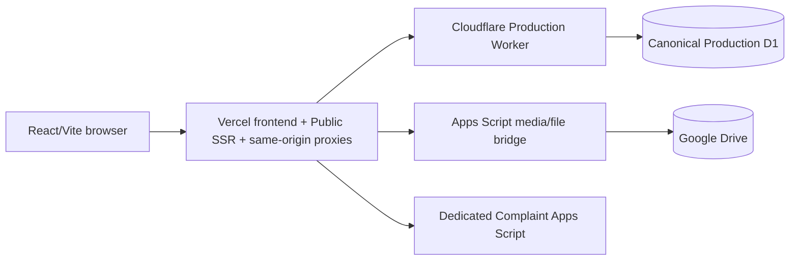

# Current Runtime Ownership

Updated: 2026-09-11.

This document is the current source of truth for runtime ownership. Historical migration milestone documents remain evidence of earlier states; when they conflict with this file about current ownership, authentication boundaries, provider responsibilities, cache policy, environment naming, or deployment behavior, this file takes precedence.

## Runtime Map



Public pages are server-rendered on Vercel. Admin/Auth remain CSR. Structured Public/Admin data remains owned by Cloudflare Worker + D1. Google Drive media/file operations remain behind the Apps Script media bridge. The complaint form is an isolated exception that reaches its dedicated Apps Script endpoint only through the same-origin Vercel complaint proxy.

Cloudflare runtime environments are intentionally reduced to local development plus one canonical production runtime. There is no persistent Preview tier. The existing Worker and data-bearing D1 originally provisioned under the physical Cloudflare name `rcat-public-api-preview` are promoted in place as Production. Their physical names and the existing Worker endpoint remain unchanged; `preview` is now only a historical label. The protected D1 UUID is the authoritative database release identity. See `docs/architecture/production-environment-convergence-2026-08-16.md`.

On 2026-09-11 the operator directly inspected the live Vercel and Cloudflare environment configuration. Vercel Production is confirmed to use server-only `COMPLAINT_API_URI`; retired `VITE_COMPLAINT_API_URI` is absent from the live Vercel environment; and the CMS-auth observation/Legacy-secret-retirement follow-ups are complete. This operator-attested production state is recorded in `docs/operations/environment-retirement-verification-2026-09-11.md`.

## Public Structured Data

Owner: Cloudflare Worker + D1.

Public SSR is a presentation/runtime layer only. It consumes the Cloudflare Public API; it does not move structured-data ownership into Vercel. There is no runtime provider selector for Public structured data: current Public reads and analytics are Cloudflare-owned.

Public Search is Worker/D1-owned. Filtering, ordering, total counting, and pagination are performed by the Public API/D1 contract rather than by a browser-owned snapshot index.

## Admin Structured Data

Owner: Cloudflare Worker + D1.

Admin structured mutations are capability-protected. Revision-aware item/order mutations are the production write contract for menu management; the legacy destructive whole-tree `PUT /api/admin/menu` contract is retired in production.

The browser reaches privileged Admin APIs through same-origin Vercel proxy routes.

## CMS Authentication

CMS Sessions are the application Admin identity.

Vercel reads the CMS Session cookie and forwards the internal CMS proxy contract. It does not authorize by a browser-supplied role.

The Worker remains authoritative for Session validity, active user status, role/capability, Session version, MFA state, CSRF, step-up assurance, and audit actor. Role/status/capabilities are derived from validated D1 state.

The observation window and legacy-only CMS-auth environment retirement are complete. Retired shared-password, legacy-session, smoke-token, old Access-identity, and obsolete auth-flag values must not be restored merely because historical cutover documentation still names them. Current closure evidence is `docs/cms-auth-project-closure.md` and `docs/operations/environment-retirement-verification-2026-09-11.md`.

### Session lifetime

- idle timeout: 30 minutes;
- absolute lifetime: 8 hours;
- touch threshold: 5 minutes.

The Admin frontend uses activity-aware keepalive so genuine local editing can cause throttled Session refresh while the page is visible. An unattended open tab must still become idle. Absolute lifetime remains server-enforced.

See `docs/cms-auth-session-lifecycle.md`.

### Admin proxy 401 contract

A genuine `CMS session is invalid or expired` response can invalidate frontend auth state. Known non-Session authentication failures must not be normalized into Session expiration. Temporary network and `5xx` failures must not automatically destroy a still-valid frontend Session.

## Operational Visibility — B1/B2/B3

Reliability Roadmap v2 Phase B is complete and production-verified. Operator visibility is explicit-refresh rather than background polling.

- **B1 System Health Dashboard** — protected `/admin/system-health` live checks reuse CMS authentication, `dashboard.read`, Request ID correlation, the Admin Proxy → Worker → D1 read path, and Public SSR.
- **B2 Runtime Incident Feed** — browser runtime errors, unhandled rejections, and API network/5xx failures are reduced to the privacy-safe allowlisted incident contract and ingested through `POST /api/public/runtime-incident`; operators read bounded aggregates through authenticated `GET /api/admin/runtime-incidents`.
- **B3 Health Aggregation** — Vercel `GET /api/health-aggregation` is a server-owned, authenticated/no-store aggregation boundary for Phase A, P6A, P6B, P6C, Vercel deployment metadata, and a bounded B2 incident summary. Infrastructure credentials are not exposed to the browser.

B2 storage remains in D1 under the seven-day/latest-2,000-row retention bounds defined by `docs/operations/phase-b-operational-visibility.md`. B3 introduces no new D1 migration or scheduler and runs only when the operator explicitly refreshes System Health.

## Admin Menu

Persistence: D1 `menu_items`.

Relationship: `parent_id`.

Public representation: nested `children`.

Admin UX: hierarchical tree, readable parent names, internal IDs hidden from routine editing, explicit paths preserved, and no automatic `/content/` prefix.

Production writes use revision-aware item and ordering endpoints. Whole-tree replacement is intentionally unavailable in production because it can erase concurrent edits or clear the menu from an incomplete payload.

See `docs/admin/admin-menu-management.md`.

## Media and Files

Owner: Apps Script media/file bridge + Google Drive storage.

The main CMS/Public structured-data backend must not be moved back to browser-side Apps Script calls. Apps Script remains the media/file bridge for the main site.

## Complaint Submission

The complaint system is an explicit isolated exception to the main structured-data ownership rule:

```text
Browser -> POST /api/complaint -> Vercel server validation -> dedicated Complaint Apps Script
```

The browser never receives or calls the complaint Apps Script URL directly. The Vercel proxy owns:

- same-origin enforcement;
- field validation and phone normalization;
- attachment count/size limits;
- MIME allowlisting, extension matching, Base64 validation, and file-signature checks;
- upstream timeout and safe error mapping;
- an allowlisted `script.google.com/macros/s/.../exec` destination.

Canonical Vercel server configuration is `COMPLAINT_API_URI`. The live Vercel Production environment was operator-verified on 2026-09-11 to contain that canonical variable and not contain retired `VITE_COMPLAINT_API_URI`. Server source may continue to recognize `VITE_COMPLAINT_API_URI` as compatibility parsing for an old deployment, but it is not current Production configuration and must not be restored merely because the fallback remains in code.

The dedicated Complaint Apps Script is not the CMS structured-data backend and is not the media/file bridge.

## Sitemap

Owner: Vercel `/api/sitemap`; public route `/sitemap.xml`; data source Cloudflare Public API / D1-backed structured data.

The runtime sitemap contains the known indexable Public route set plus published canonical content URLs in the `/content/$slug` namespace. Dynamic content is sourced from News, Announcements (including published Public page items), and Blog content. Programs currently have the indexable `/departments` listing route but no canonical Public content-detail route, so program records are not emitted as `/content/$slug` sitemap entries. Search, Admin/Auth/API surfaces, legacy `/$slug` permalinks, menu aliases, drafts, and content with an external absolute canonical are excluded.

## Public SSR Runtime

Runtime construction is request-scoped:

- `createAppQueryClient()` creates a new TanStack Query `QueryClient`;
- `createAppRouter()` creates a request/runtime-local TanStack Router;
- `createAppEmotionCache()` creates a request/runtime-local Emotion cache;
- server runtimes use Router document mode to render complete HTML documents.

Public route loaders reuse the same TanStack Query factories consumed by browser hooks. Successful known-Public query roots are dehydrated through a JSON-safe DTO and restored into the browser QueryClient before hydrated route hooks consume them.

TanStack Router renders through `renderRouterToStream`. The current Emotion critical-CSS finalizer then reads/buffers the completed response body before injecting request-local critical styles and returning the Vercel response. The implementation therefore uses the Router streaming renderer internally but does not currently deliver progressive HTML chunks through the final Emotion/Vercel response boundary.

The final SSR document contains semantic route HTML, route-owned metadata/JSON-LD, request-local Emotion critical CSS, TanStack hydration state, and manifest-selected content-hashed client assets.

SSR documents carry `data-rcat-ssr="true"`; Admin/Auth CSR pages retain the empty-`#root` bootstrap.

## Public API / Loader Error Semantics

Public reads use the shared `PublicReadError` taxonomy: `aborted`, `network`, `http`, `invalid-json`, or `invalid-response`.

Raw backend errors are not serialized into Router hydration data. Failed Public prefetches become a small JSON-safe upstream-failure marker. The SSR response boundary maps that condition to HTTP `503 Service Unavailable` with `Retry-After: 300`, `Cache-Control: no-store`, and `X-Robots-Tag: noindex, nofollow`.

Published canonical content returns `200`. Missing/unpublished content returns Router-native `404`. A valid legacy `/$slug` resolves first and permanently redirects with `301` to `/content/$slug`; missing legacy slugs remain `404`.

Search receives `X-Robots-Tag: noindex, follow`. CMS/Auth/Admin surfaces receive `noindex, nofollow`.

## Public URL State and Data Contracts

Public list URL state is owned by TanStack Router. Route search validators normalize the supported pagination/filter/search fields while unrelated query parameters are preserved. Pagination writes use TanStack navigation rather than browser-history shadow state.

Public API list/search/home contracts use summary items without article body fields. Content detail retains the full body plus referenced media only. Paginated content/search reads use D1 `COUNT(*)` plus `LIMIT/OFFSET`.

Live visitor statistics remain browser-oriented polling rather than an SSR loader dependency.

## Public Analytics Abuse Protection and Retention

Public analytics write routes remain unauthenticated by design, but Worker-side abuse protection applies rate limits keyed from Cloudflare client-IP metadata into short-lived hashed D1 buckets. The raw IP is not persisted by the rate-limit table.

Current per-minute ceilings are:

- site views: 120;
- presence heartbeats: 240;
- content views: 90.

Runtime-incident ingestion uses its own Cloudflare edge rate-limiting binding at 30 requests/minute/client key; it does not add a D1 rate-counter row for every incident.

Migration `0007_public_analytics_abuse_guard.sql` is required before deploying Worker code that enables the analytics guard. B2 runtime incidents use migration `0014_b2_runtime_incidents.sql`.

Production Worker scheduled cleanup runs daily. Retention policy:

- `public_write_rate_limits`: delete after bucket expiry;
- `visitor_presence`: retain 2 days;
- `visitor_events`: retain 90 days;
- `content_view_events`: retain 90 days;
- `runtime_incidents`: retain 7 days and bound storage to the latest 2,000 aggregate rows;
- daily aggregate statistics: retained; they are not deleted by raw-event cleanup.

## SEO Ownership

TanStack Router route `head` descriptors own document metadata. Public canonical pagination is derived from validated Router search state. Search stays `noindex,follow` with canonical `/search`.

Content detail prioritizes CMS `seoTitle`, `seoDescription`, and `canonicalUrl`, uses referenced featured media with site hero fallback for social images, and emits the applicable Article/Breadcrumb/Organization/WebSite structured data.

## Vercel SSR / CSR Routing Boundary

- Public application routes -> `api/ssr.ts` through the final Vercel catch-all rewrite;
- `/login`, `/activate-account`, `/reset-password`, `/admin`, and `/admin/:path*` -> static CSR fallback `csr.html`;
- API/proxy/sitemap routes remain ahead of the Public catch-all;
- static files continue to be served by Vercel filesystem handling.

The production build runs the normal Vite client build, validates manifest-selected content-hashed client JS/CSS assets, and renames `dist/index.html` to `dist/csr.html`. `dist/index.html` is intentionally absent from deployment output so filesystem precedence cannot bypass Public SSR at `/`.

The Public SSR adapter supports GET/HEAD, rejects unsupported methods with `405`, and converts unexpected adapter/render exceptions to a protected `503` response.

Server-side Public API configuration uses `CLOUDFLARE_PUBLIC_API_URL`. Browser code uses `VITE_CLOUDFLARE_PUBLIC_API_URL`; the server may consume that browser-safe alias only as a compatibility fallback when the server-only variable is absent. There is no `PUBLIC_API_PROVIDER` or `VITE_PUBLIC_API_PROVIDER` runtime selector.

## Cache Policy

When deployed to Vercel:

- successful stable/indexable Public index/list SSR: browser `Cache-Control: public, max-age=0, must-revalidate`; Vercel CDN `public, max-age=120, stale-while-revalidate=3600`;
- dynamic canonical content detail `/content/:slug`: `Cache-Control: no-store` and no shared Vercel CDN cache directive;
- Public Shell browser query: stale after 2 minutes, refetches on window focus and reconnect;
- Search and error responses: `Cache-Control: no-store`, no Vercel CDN cache directive;
- permanent legacy redirects: browser revalidation plus Vercel CDN `max-age=86400, stale-while-revalidate=604800`;
- `csr.html`: `no-store`, `X-Robots-Tag: noindex, nofollow`;
- manifest-selected client entry/styles and lazy chunks use content-hashed filenames; the SSR build fails closed if the manifest-selected entry/styles are unavailable.

This policy intentionally prevents publish/delete checks and normal content-detail reads from observing stale shared-CDN content while retaining bounded caching for stable public index/list SSR surfaces.

## Production Deployment Boundaries

- frontend/UI + Public SSR + Vercel functions/proxies, including B3 `/api/health-aggregation` -> Vercel;
- Worker source/config -> existing Cloudflare production Worker physical resource;
- D1 schema and structured data -> existing canonical production D1;
- Apps Script media bridge `.gs` -> Apps Script;
- dedicated Complaint Apps Script -> its own Apps Script deployment;
- docs/tests only -> no runtime deployment.

Vercel deploys `master` through Git integration. Non-master Vercel deployments are disabled by repository configuration.

Cloudflare has no persistent Preview deployment tier. Local development uses `rcat-public-api-local`; all remote structured data and Worker releases target the canonical production role.

The canonical production Worker and D1 are the existing data-bearing resources whose legacy physical Cloudflare name remains `rcat-public-api-preview`. They are promoted in place: no replacement Worker URL, export/import, or data copy is part of the environment convergence. The old empty D1 named `rcat-public-api-production` and the unused Worker of the same name were manually deleted on 2026-08-16 and are not recreated.

Cloudflare production release is explicit rather than automatic. `.github/workflows/worker-production.yml` is manual (`workflow_dispatch`), must run from `master`, typechecks first, verifies that the legacy physical D1 resource matches the protected production UUID, captures a current Time Travel bookmark, lists pending migrations, runs fixture gates, injects the production D1 UUID from the `RCAT_PRODUCTION_D1_DATABASE_ID` GitHub secret into a temporary config, applies pending D1 migrations to the promoted data-bearing D1, and then deploys the `env.production` configuration back onto the same existing Worker physical resource `rcat-public-api-preview`.

The tracked `wrangler.toml` must keep `production-placeholder`; a real production D1 ID must never be committed. Both physical Worker and D1 names containing `preview` are legacy resource labels only and must not be treated as non-production environments. `keep_vars = true` preserves dashboard-managed non-secret Worker variables not represented in the tracked configuration, while encrypted Worker secrets remain preserved unless explicitly deleted.

If Vercel Production already points to the existing `rcat-public-api-preview` Worker endpoint, no Vercel URL variable change is required solely for this convergence.

Required Worker release secrets:

- `CLOUDFLARE_ACCOUNT_ID`;
- `CLOUDFLARE_API_TOKEN`;
- `RCAT_PRODUCTION_D1_DATABASE_ID` — UUID of the promoted data-bearing D1.

See `docs/architecture/production-environment-convergence-2026-08-16.md` and `docs/deployment/runtime-deployment-guide.md`.

## Toolchain

Current repository contract:

- Node `24.x`;
- pnpm `10.34.5`.

Any document that still describes Node 22 as current is stale historical text.

## Security Boundary

Do not place CMS Session tokens, passwords, TOTP secrets/codes, Recovery Codes, encryption keys, proxy shared secrets, Apps Script bridge tokens, production D1 IDs, or private deployment identifiers in browser code, docs, issues, commits, or chat logs.

Complaint endpoint configuration is server-owned. Live Vercel Production uses `COMPLAINT_API_URI`; retired `VITE_COMPLAINT_API_URI` is operator-verified absent and must not be restored to the live environment. Do not restore browser code that reads a `VITE_` complaint endpoint.

Legacy-only CMS-authentication values retired by the completed final cutover must remain absent from the applicable live Vercel/Cloudflare environments. Current authentication remains CMS Session + D1 user/capability state + MFA/CSRF/step-up, with `CMS_AUTH_PROXY_SECRET` retained as the internal server-to-Worker proxy boundary.

## Historical Documentation

`docs/architecture/current-migration-status.md`, milestone readiness/cutover notes, `docs/architecture/m20-cleanup-runtime-ownership.md`, `docs/architecture/ssr-implementation-phases.md`, and the M5/M6 Preview provisioning/smoke documents retain historical value but are not the current ownership or environment source when they contain older provider/auth/cache/deployment descriptions.

In particular, references in historical M5/M6 documents to a persistent non-production `preview` environment describe the migration process at that time. They do not describe the post-2026-08-16 runtime. Historical SSR implementation-phase text describes the integration/cutover state before production activation and does not override the current SSR renderer, asset, provider, cache, or sitemap contracts in this document.
