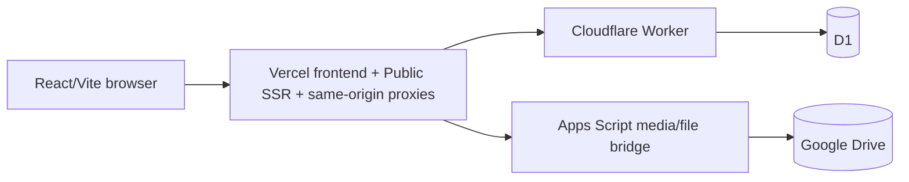

# Current Runtime Ownership

Updated: 2026-08-04.

This document is the current source of truth for runtime ownership. Historical migration milestone documents remain evidence of earlier states; when they conflict with this file about current ownership, authentication boundaries, or provider responsibilities, this file takes precedence.

## Runtime Map

The Phase 7 code path makes Public pages server-rendered on Vercel when that integration is deployed. Admin/Auth deliberately remain CSR. The currently deployed production site does not change merely because this code exists on the integration branch; live cutover requires an explicit promotion to `master` and a successful Vercel deployment.

## Public Structured Data

Owner: Cloudflare Worker + D1.

Public SSR is a presentation/runtime layer only. It consumes the existing Cloudflare Public API; it does not move structured-data ownership into Vercel.

## Admin Structured Data

Owner: Cloudflare Worker + D1. Admin structured mutations remain revision-aware and capability-protected. The browser reaches privileged Admin APIs through same-origin Vercel proxy routes.

## CMS Authentication

CMS Sessions are the application Admin identity.

Vercel reads the CMS Session cookie and forwards the internal CMS proxy contract. It does not authorize by a browser-supplied role.

The Worker remains authoritative for Session validity, active user status, role/capability, Session version, MFA state, CSRF, step-up assurance, and audit actor. Role/status/capabilities are derived from validated D1 state.

## CMS Session Lifetime

Current policy:

- idle timeout: 30 minutes;
- absolute lifetime: 8 hours;
- touch threshold: 5 minutes.

The Admin frontend supports activity-aware keepalive so genuine local editing can cause throttled Session refresh while the page is visible. An unattended open tab must still become idle. Absolute lifetime remains server-enforced.

See `docs/cms-auth-session-lifecycle.md`.

## Admin Proxy 401 Contract

A genuine `CMS session is invalid or expired` response can invalidate frontend auth state.

Known non-Session authentication failures must not be blindly normalized into Session expiration. Temporary network and `5xx` failures must not automatically destroy a still-valid frontend Session.

## Admin Menu

Persistence: D1 `menu_items`.

Relationship: `parent_id`.

Public representation: nested `children`.

Admin UX: hierarchical tree, readable parent names, internal IDs hidden from routine editing, explicit paths preserved, and no automatic `/content/` prefix.

See `docs/admin/admin-menu-management.md`.

## Media and Files

Owner: Apps Script media/file bridge + Google Drive storage.

Apps Script is not the structured-data backend and must not be restored as a browser-side structured-data provider.

## Sitemap

Owner: Vercel `/api/sitemap`; public route `/sitemap.xml`; data source Cloudflare Public API / D1-backed structured data.

The runtime sitemap contains only the known indexable Public route set plus published canonical content URLs in the `/content/$slug` namespace. Search, Admin/Auth/API surfaces, legacy `/$slug` permalinks, menu aliases, drafts, and content with an external absolute canonical are excluded. Program content is sourced from the Public programs contract alongside News, Announcements, and Blog content.

## Public SSR Runtime

Runtime construction is request-scoped:

- `createAppQueryClient()` creates a new TanStack Query `QueryClient` with project defaults;
- `createAppRouter()` creates a new TanStack Router and receives the runtime QueryClient through typed context;
- `createAppEmotionCache()` creates an Emotion cache with the stable `css` namespace;
- `createAppRuntime()` creates one fresh Emotion cache, QueryClient, and Router per browser runtime or server request;
- server runtimes set Router `documentMode=true` so the root route renders a complete HTML document rather than the CSR fragment shell.

Public route loaders call `ensureQueryData()` with the same reusable query factories already consumed by React hooks. No second server-side data store is introduced. Successful known-Public query roots are dehydrated through a JSON-safe DTO and restored into the browser QueryClient before hydrated route hooks consume them.

The server renderer is non-streaming. `entry-server.tsx` binds a Web `Request` to a request-local Router through TanStack Router `createRequestHandler`, renders `RouterServer` with `renderRouterToString`, extracts request-local Emotion critical CSS, and then applies Phase 6 HTTP/indexing semantics.

The production SSR document includes:

- semantic route HTML before JavaScript;
- route-owned title, description, canonical, Open Graph, Twitter metadata, and JSON-LD;
- request-specific Emotion critical CSS in the document head;
- TanStack Router/Query hydration state;
- deterministic `/assets/rcat-client.css` and `/assets/rcat-client.js` entry assets.

SSR documents carry `data-rcat-ssr="true"`. The browser detects that marker and hydrates at the document root with `hydrateRoot(document, ...)`. Admin/Auth CSR pages retain the empty-`#root` `createRoot()` bootstrap.

## Public API / loader error semantics

Public reads use the shared `PublicReadError` taxonomy: `aborted`, `network`, `http`, `invalid-json`, or `invalid-response`.

Raw backend errors are not serialized into Router hydration data. Failed Public prefetches become a small JSON-safe upstream-failure marker. The SSR response boundary maps that condition to HTTP `503 Service Unavailable` with `Retry-After: 300`, `Cache-Control: no-store`, and `X-Robots-Tag: noindex, nofollow`.

Published canonical content returns `200`. Missing/unpublished content returns Router-native `404`. A valid legacy `/$slug` resolves the content first and then permanently redirects with `301` to `/content/$slug`; missing legacy slugs remain `404`.

Search receives `X-Robots-Tag: noindex, follow`. CMS/Auth/Admin surfaces receive `noindex, nofollow`.

## Public URL state and data contracts

Public list URL state is owned by TanStack Router. Route search validators normalize `page`, `announcementsPage`, `pagesPage`, `tag`, `category`, and `q` where applicable; unrelated query parameters are preserved. Pagination writes use TanStack navigation rather than browser-history shadow state.

Public API list/search/home contracts use summary items without article body fields. Content detail retains the full body plus referenced media only. Paginated content/search reads use D1 `COUNT(*)` plus `LIMIT/OFFSET`; the secondary Public-page collection in Announcements is independently D1-paginated with `pagesPage`/`pagesPageSize`.

Live visitor statistics remain browser-oriented polling rather than an SSR loader dependency.

## SEO ownership

TanStack Router route `head` descriptors own document metadata. Public canonical pagination is derived from validated Router search state. Page 2+ is self-canonical; page 1/invalid values collapse to the base route; filter/tracking parameters are not copied into archive canonicals. Search stays `noindex,follow` with canonical `/search`.

Content detail prioritizes CMS `seoTitle`, `seoDescription`, and `canonicalUrl`, uses referenced featured media with site hero fallback for social images, and emits article metadata plus `NewsArticle`/`Article`/`WebPage`, `BreadcrumbList`, `EducationalOrganization`, and `WebSite` JSON-LD where appropriate.

## Vercel SSR / CSR routing boundary

When the completed SSR integration is deployed:

- Public application routes -> `api/ssr.ts` through the final Vercel catch-all rewrite;
- `/login`, `/activate-account`, `/reset-password`, `/admin`, and `/admin/:path*` -> static CSR fallback `csr.html`;
- API/proxy/sitemap rewrites remain ahead of the Public catch-all;
- static files continue to be served by Vercel's filesystem handling.

The production build runs normal Vite client build first, validates the deterministic client JS/CSS assets, then renames `dist/index.html` to `dist/csr.html`. `dist/index.html` is intentionally absent from deployment output so Vercel filesystem precedence cannot bypass the Public SSR rewrite at `/`.

The Public SSR adapter reconstructs the original route URL from the Vercel rewrite parameter, supports GET/HEAD, rejects unsupported methods with `405`, and converts unexpected adapter/render exceptions to a protected `503` response.

Server-side Public API configuration may use `PUBLIC_API_PROVIDER=cloudflare` and `CLOUDFLARE_PUBLIC_API_URL`; the existing `VITE_PUBLIC_API_PROVIDER` and `VITE_CLOUDFLARE_PUBLIC_API_URL` names remain supported for compatibility.

## Cache policy

When deployed to Vercel:

- successful indexable Public SSR: browser `Cache-Control: public, max-age=0, must-revalidate`; Vercel CDN `public, max-age=300, stale-while-revalidate=86400`;
- Search and error responses: `Cache-Control: no-store`, no Vercel CDN cache directive;
- permanent legacy redirects: browser revalidation plus Vercel CDN `max-age=86400, stale-while-revalidate=604800`;
- `csr.html`: `no-store`, `X-Robots-Tag: noindex, nofollow`;
- fixed client entry JS/CSS: browser revalidation; hashed lazy chunks retain Vite hashed filenames.

## Production activation status

All SSR/SEO implementation code is complete once Phase 7 is merged into `refactor/ssr-readiness`, but the live website remains whatever `master` currently deploys until the user explicitly authorizes promotion of the integration line to `master`.

A Phase 7 Vercel Preview request was blocked by the account's Free-plan build-rate limit (`upgradeToPro=build-rate-limit`). Focused repository validation, full document rendering, cutover output validation, and SSR/function bundle smoke pass independently. Live Vercel crawler validation remains a required post-deployment check when deployment capacity is available.

See `docs/architecture/ssr-implementation-phases.md` and `docs/operations/public-ssr-cutover.md`.

## Deployment Boundaries

- frontend/UI + Public SSR + Vercel functions/proxies -> Vercel;
- Worker source/config -> Cloudflare Worker;
- D1 schema -> D1 migration;
- Apps Script `.gs` -> Apps Script;
- docs/tests only -> no runtime deployment.

See `docs/deployment/runtime-deployment-guide.md`.

## Toolchain

Current repository contract:

- Node `24.x`;
- pnpm `10.34.5`.

Any document that still describes Node 22 as current is stale historical text.

## Security Boundary

Do not place CMS Session tokens, passwords, TOTP secrets/codes, Recovery Codes, encryption keys, proxy shared secrets, Apps Script bridge tokens, production D1 IDs, or private deployment identifiers in browser code, docs, issues, commits, or chat logs.

## Historical Documentation

`docs/architecture/current-migration-status.md` and `docs/architecture/m20-cleanup-runtime-ownership.md` retain historical value but are not the current ownership source when they contain older provider/auth/toolchain descriptions.
