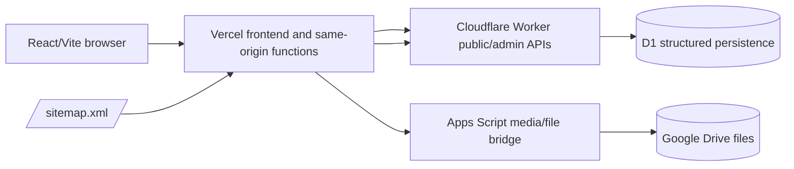

# M20 Cleanup Runtime Ownership

Status: M20 migration/runtime/domain-cutover scope is closed.

Current source-of-truth snapshot: 2026-07-19 at baseline commit `80324e71982411c67e6f3f9b66e06b09ab7bb282`.

M20 is closed for migration/runtime ownership. M21 owns remaining UI/UX and logic stabilization.

M20 closure is limited to migration, runtime ownership, and domain cutover scope. It does not mean the UI/UX is complete, the system is defect-free, or all business workflows are final.

## M20 Closure Note

- The custom domain `www.rcat.ac.th` is connected to the Vercel production deployment.
- The Cloudflare/Vercel redirect loop was resolved at the provider configuration layer.
- Cloudflare Worker allowed origins include the production custom domain.
- Cloudflare Worker and D1 own structured public and admin data.
- Apps Script remains only the media/file bridge for Google Drive file operations.
- No D1 migration blocker remains for M20 migration/runtime ownership.
- No Apps Script structured-data blocker remains.
- No runtime ownership blocker remains.
- Remaining UI/UX, business logic, workflow, usability, validation, layout, content-presentation, Thai wording, and user-facing error issues move to M21.

## Current Runtime Ownership

- Public structured reads: Cloudflare Worker and D1 through `VITE_PUBLIC_API_PROVIDER=cloudflare` and `VITE_CLOUDFLARE_PUBLIC_API_URL`.
- Public analytics: Cloudflare Worker and D1 for site view, content view, visitor presence, and live visitor stats.
- Admin structured reads and writes: Cloudflare Worker and D1 through the configured admin write provider.
- Admin user access: Cloudflare RBAC plus D1 app user profiles in `app_admin_users`.
- Admin proxy session: Vercel server-side proxy authenticates the CMS login session and forwards role/email context to the Worker.
- Media and file bridge: Vercel `/api/apps-script-proxy` forwards authenticated media/file requests to Apps Script.
- File storage: Google Drive remains the media/document storage target behind the Apps Script media bridge.
- Runtime sitemap: Vercel `/sitemap.xml` rewrites to `/api/sitemap`, which reads live public menu/content from the Cloudflare Worker/D1 API.

The admin authentication boundary remains the Vercel server-side session proxy plus Cloudflare RBAC/D1 app-user profiles. The proxy's credential hash and session secret are server-only. `bcryptjs` is reachable only from `server/adminProxy/handlers.mjs`, not the browser bundle; its future major upgrade remains separate auth work.

## Admin Operation Feedback Standardization

The current CMS write-feedback standard was established by:

- `7f5f95083b5df18c5c73939bf2b1e251c3880a97` `fix(admin): make media operation results explicit`
- `8aa55b3b22dd6a121fbaa799899670766f776abb` `fix(admin): standardize operation feedback`

CMS write operations use a blocking loading modal while pending, a centered success modal requiring acknowledgment, and a centered error modal requiring acknowledgment. Final admin write results must not use short auto-dismiss success toasts.

Affected areas: Media, Content, Documents, Menu, Users, Calendar, Carousel, E-Service, and Settings.

## Public UX Updates

The urgent marquee speed normalization was established by:

- `4b8f01a2162ef8de002a8c2c46c69110f7b749e2` `fix(ui): normalize marquee speed across devices`

The marquee uses measured distance and pixels per second for device-independent visual speed. Reduced-motion still slows the ticker instead of disabling it. This was a frontend-only UI change and did not require Worker, D1, or Apps Script deployment.

## M21 Stabilization Handoff Checklist

- [ ] public home
- [ ] marquee
- [ ] carousel
- [ ] menu
- [ ] content/news/announcements
- [ ] documents
- [ ] E-Service
- [ ] calendar
- [ ] media upload/delete
- [ ] admin content save/publish/delete
- [ ] settings save
- [ ] mourning mode
- [ ] visitor stats / Who's Online
- [ ] user management
- [ ] Apps Script media bridge status
- [ ] Cloudflare public/admin structured status

## Apps Script Scope

Apps Script is retained only for the Google Drive media/file bridge and related file operations.

Apps Script is no longer the active user-management backend.

The CMS Integrations page no longer uses the legacy browser-side Google connection health facade. It reports:

- Cloudflare structured-data status from the configured admin write provider.
- Apps Script media bridge readiness from Vercel `/api/apps-script-proxy`.
- Google Drive media storage readiness through the same authenticated bridge status.

Removed legacy user-management paths:

- Direct Apps Script user account CRUD from frontend services.
- Local bootstrap user fallback.
- Password-hash based local user account management.
- Legacy `VITE_GOOGLE_APPS_SCRIPT_URL` production-auth requirement for admin login.

## Admin User Profiles

Admin user profiles are stored as metadata in D1 table:

- `app_admin_users`

The table stores:

- email
- name
- role
- status
- audit metadata
- revision metadata

The table must not store:

- passwords
- password hashes
- reset tokens
- API tokens
- secrets
- production credentials

## RBAC Matrix

### User Management

| Role   | Permission                                                                                 |
| ------ | ------------------------------------------------------------------------------------------ |
| admin  | Can manage other users, cannot delete self, cannot remove or disable the last active admin |
| editor | Can edit own profile only, cannot delete self, cannot change role or status                |
| viewer | Can view the user list only                                                                |

### Content And Admin Data

| Role   | Permission                                                                                                                                         |
| ------ | -------------------------------------------------------------------------------------------------------------------------------------------------- |
| admin  | Can manage all content, media, settings, menu, integrations, and users                                                                             |
| editor | Can manage content, documents, carousel, E-Service, media, and events; cannot manage website settings, menu, integrations, or system configuration |
| viewer | Read-only reviewer before publish; cannot create, update, delete, upload, or publish                                                               |

## Historical Environment Categories At M20 Closure

This section records the M20 deployment categories without preserving retired
authentication variable names as active configuration. Phase 8 permanently
retired the former shared-password, Legacy Session, email-allowlist, role-matrix,
smoke-token, and Access-identity settings. See
`docs/cms-auth-final-cutover.md` for the final runtime configuration and
retirement sequence.

### Vercel Admin Proxy

- `CLOUDFLARE_ADMIN_API_URL`
- CMS proxy secret and CMS Session configuration

### Vercel Runtime Sitemap

- `PUBLIC_SITE_URL` (preferred) or `VITE_PUBLIC_SITE_URL` (fallback)
- `CLOUDFLARE_PUBLIC_API_URL` (preferred) or `VITE_CLOUDFLARE_PUBLIC_API_URL` (fallback)

### Cloudflare Worker

- `ADMIN_WRITE_ALLOWED_ORIGINS`
- CMS proxy secret and MFA encryption configuration
- `DB`

### Apps Script Media Bridge

- `GOOGLE_APPS_SCRIPT_URL` or `APPS_SCRIPT_WEB_APP_URL`
- `APPS_SCRIPT_BRIDGE_TOKEN`

Do not expose bridge URLs or bridge tokens through `VITE_` variables. `VITE_GOOGLE_APPS_SCRIPT_URL` is not server runtime configuration and must not be restored for the media bridge.

## Required D1 Migrations

Required historical and current migrations must be retained.

Current M20-related migrations include:

- `cloudflare/public-api/migrations/0006_m20_visitor_presence.sql`
- `cloudflare/public-api/migrations/0007_admin_user_profiles.sql`

Do not delete old migrations.

## Removed Or No-Op Paths

- Public analytics no longer falls back to direct Apps Script calls when the public provider is not Cloudflare.
- Public site-view, content-view, and presence calls become safe no-ops outside Cloudflare provider mode.
- The Vercel Apps Script media bridge no longer reads `VITE_GOOGLE_APPS_SCRIPT_URL` as server configuration.
- Admin user management no longer uses direct Apps Script user CRUD.
- The legacy browser-side `checkGoogleConnection()` integrations health mapper is removed from the frontend.

## Safety State

- M19 remains closed.
- M20 is closed for migration/runtime ownership.
- M21 owns remaining UI/UX and logic stabilization.
- M20 closure does not certify defect-free production behavior.
- This cleanup does not mutate Cloudflare, Vercel, Apps Script, Google Drive, D1, or production runtime.
- No secrets, real tokens, real D1 ids, real Access AUD values, or private credentials belong in this document.
